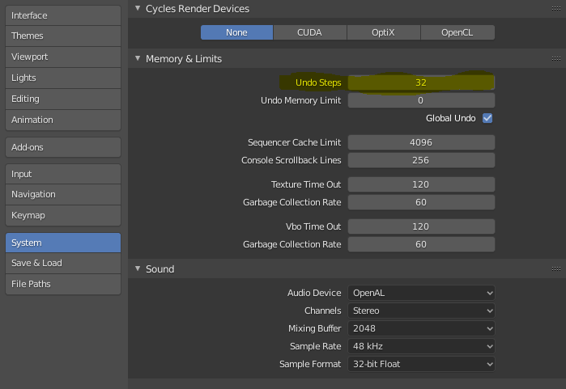

# Steps to Customize Working with Blender
Optional step that might simplify the handling of blender.

## Undo Steps 
Blender offers to step back for 32 steps. For more complex models, this number should be increased in the settings.

## Show Screencast Keys
To share you work with others, it is useful to display the currently pressed keys. The add on can be 
downloaded here: https://github.com/nutti/Screencast-Keys/releases/tag/v3.0
To install, go to Edit > Preferences > Addon > Install. Browse to the .zip file, press Install. Then activate the addon and save preferences.